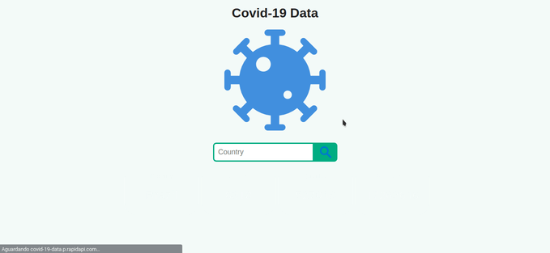

# Covid19Data

<p align="center">Esse é um projeto para ajudar na informação sobre os casos da pandemia do novo covid-19.</p>

<p align="center">
 <a href="#features">Features</a> •
 <a href="#clonando-a-aplicação">Clonando o app.</a> • 
 <a href="#acessando-a-aplicação">Acessando o app.</a> • 
 <a href="#tecnologias">Tecnologias</a> •
 <a href="#autor">Autor</a> •

</p>

---

<br>

<h1 align="center">
  
</h1>

## [Live Preview](https://covid19pbpeterson.netlify.app/)

### Features

- [x] Responsivo em todos os tipos de tela.
- [x] É possivel obter os dados de qualquer país buscando o nome em ingles.
- [x] A aplicação consome a API do do rapidAPI.

### 🎲 Clonando a aplicação

```bash
$ git clone https://github.com/pbpeterson/updayNextJs

```

### 🛠 Tecnologias

As seguintes ferramentas foram usadas na construção do projeto:

- [HTML5](https://www.typescriptlang.org/)
- [CSS3](https://nextjs.org/)
- [JavaScript](https://next-auth.js.org/)
- [API Covid19 Data](https://rapidapi.com/Gramzivi/api/covid-19-data)

---

### 👨🏾‍💻 Autor

- Website: https://pbpeterson.github.io
- Github: @pbpeterson
- LinkedIn: @pbpeterson
